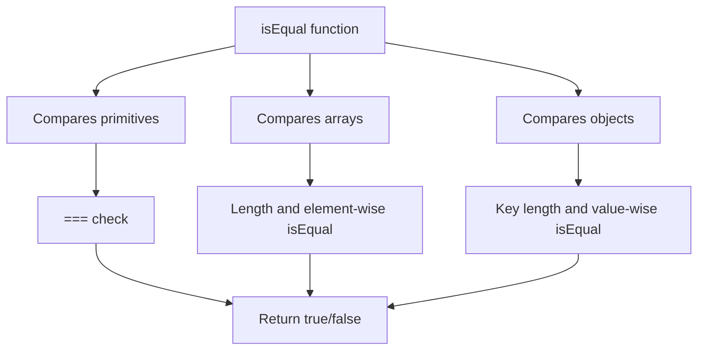

# isEqual

> Deep equality check for objects, arrays, and primitives

## Installation

```bash
npm install @nlabs/utils
```

## Usage

```js
import { isEqual } from '@nlabs/utils/checks';

isEqual({ a: 1, b: 2 }, { b: 2, a: 1 }); // true
isEqual([1, 2, 3], [1, 2, 3]); // true
isEqual('hello', 'hello'); // true
isEqual({ a: 1 }, { a: 2 }); // false
isEqual([1, 2], [1, 2, 3]); // false
```

## API

```ts
isEqual(a: any, b: any): boolean
```
- `a`: First value to compare
- `b`: Second value to compare
- Returns `true` if deeply equal, `false` otherwise

## How it Works

- Checks for strict equality (`===`)
- Handles `null` and `undefined`
- Compares arrays by length and element-wise
- Compares objects by keys and value-wise
- Recursively checks nested structures



## Examples

### Primitives
```js
isEqual(1, 1); // true
isEqual('a', 'a'); // true
isEqual(true, false); // false
```

### Arrays
```js
isEqual([1, 2], [1, 2]); // true
isEqual([1, 2], [2, 1]); // false
```

### Objects
```js
isEqual({ a: 1, b: 2 }, { b: 2, a: 1 }); // true
isEqual({ a: 1 }, { a: 2 }); // false
```

### Nested Structures
```js
isEqual({ a: [1, 2], b: { c: 3 } }, { b: { c: 3 }, a: [1, 2] }); // true
```

## Use Cases
- Comparing form values
- Detecting changes in state management
- Deep comparison in tests
- Memoization and caching

## Performance
- Optimized for common cases (primitives, shallow objects)
- Recursion for deep/nested structures
- No dependencies

## TypeScript
- Fully typed, accepts any value
- Returns boolean

## Edge Cases
- Handles `null` and `undefined`
- Handles arrays vs objects
- Does not compare functions or symbols deeply
- Does not handle circular references

## Migration from Lodash

```js
// Lodash
_.isEqual({ a: 1 }, { a: 1 }); // true
// @nlabs/utils
isEqual({ a: 1 }, { a: 1 }); // true
```

## Related
- [isEmpty](./isEmpty.md)
- [isArray](./isArray.md)
- [isPlainObject](./isPlainObject.md)